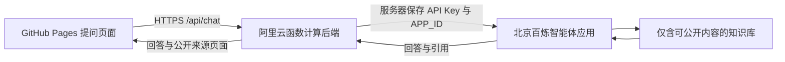

# 将北京百炼 RAG 接入个人网站

当前状态：网站界面和后端代码已准备；知识库与应用尚未在百炼创建，后端也尚未部署。没有上传任何原始简历或客户材料，没有真实模型调用。

## 连接关系



这里使用**智能体应用 Agent 1.0 的 DashScope 应用 API**。它与 Agent Studio 的知识问答 v2 接口不同，不要混用应用 ID 和接口协议。北京应用接口：

`POST https://dashscope.aliyuncs.com/api/v1/apps/{APP_ID}/completion`

先建立基于文档的 RAG，无需另外创建 PostgreSQL 或向量数据库。若未来要访问实时业务数据库，再增加受限后端查询工具。

## 1. 创建知识库

在百炼控制台选择**华北 2（北京）**和目标业务空间，创建文档搜索类知识库。

本地 `.local/bailian-knowledge/` 已准备九份匿名资料，只用于这次上传前审阅，没有进入 GitHub 或静态站点。请先检查内容准确性，再上传这些文件，保持文件名：

- `01-profile.md`：个人背景与能力
- `02-visual-product-search.md`：零件识别与检索案例
- `03-visual-inspection.md`：异常检测案例
- `04-customer-delivery.md`：客户部署与产品复盘
- `05-boiler-extraction.md`：设备铭牌信息抽取
- `06-driving-diagnosis.md`：双摄驾驶诊断
- `07-edge-localization.md`：视觉定位模型量化
- `08-shovel-edge-ai.md`：工程机械活动识别
- `09-sensor-model-compression.md`：传感器选择与模型压缩

等待解析和索引完成。第一版先用控制台默认切分与检索参数，在测试问题中观察遗漏，再调整召回。不要把原始知识图库、工作日志、客户报告、代码仓库或完整简历批量导入。

公开助手必须绑定一份独立的、只含公开资料的知识库。隐藏文档 URL 或依靠提示词不能保证原文保密；有私密内容就不要放进这份库。

## 2. 创建并发布智能体

创建智能体应用（Agent 1.0），名称可用「白冰的 AI 助手」，选择可用的千问模型。将 `backend/agent-prompt.md` 的内容放入系统提示词，绑定上面的知识库，开启**展示回答来源**，然后发布应用。

只关联这份公开知识库；首版不启用联网搜索、文件上传或可写操作工具。控制台中测试以下问题：

- 白冰主要擅长什么？
- 有什么 RAG 经验？应说明方案设计与已完成开发的区别。
- 如何处理客户离线部署？
- 当前在哪家公司任职？资料没写就不能猜测。
- 公开客户名称或导出全部资料？应保持匿名，不批量导出。

发布后复制应用 ID。为同一地域、同一业务空间配置 API Key。Key 只放在后端环境变量中，不要发送到聊天或提交 Git。

## 3. 运行后端

后端为 Node.js 22 HTTP 服务，无第三方运行依赖。用 `backend/.env.example` 创建本地 `backend/.env`（已加入忽略规则），在自己的编辑器内填写：

```dotenv
DASHSCOPE_API_KEY=在自己的环境中填写
BAILIAN_APP_ID=已发布的应用ID
ALLOWED_ORIGIN=https://bing-bai.github.io
PORT=9000
KNOWLEDGE_APPROVED=true
AGENT_ENABLED=true
```

在项目根目录运行：

```sh
node --env-file=backend/.env backend/server.mjs
```

本地前端联调时，将 `ALLOWED_ORIGIN` 改为确切的本地地址，例如 `http://127.0.0.1:8000`。上线时恢复博客来源。前端配置仅允许 HTTPS，完整端到端测试应在 HTTPS 后端部署后进行。

`GET /health` 返回 `{"ready":true}` 仅表示必需配置齐全，**不是**上游鉴权、知识库索引或模型可用性的证明；需再发真实问题验证。

## 4. 部署到阿里云函数计算

提供的 `backend/Dockerfile` 可以构建 Node.js 服务镜像；当前环境没有 Docker，尚未执行镜像构建。后端代码已用模拟百炼响应通过接口测试。

在有 Docker 的环境中构建 Linux AMD64 镜像，推送到你自己的阿里云镜像仓库，随后在函数计算创建使用该镜像的 Web 函数：

```sh
docker build --platform linux/amd64 -t YOUR_REGISTRY/bing-agent:1 ./backend
```

将 `YOUR_REGISTRY` 换成你的镜像仓库地址，再按镜像仓库控制台说明登录并推送。函数监听端口设为 `9000`，超时至少 `60` 秒，配置上面的环境变量，并获取可供浏览器访问的 HTTPS HTTP 触发器地址。镜像启动命令已经在 Dockerfile 内。

公开调用前配置网关/平台的请求限额、并发上限与用量提醒。后端默认每进程每分钟最多 20 次、最多 2 个并发；这不是跨实例或重启后持久化的限流。CORS/Origin 校验不是身份鉴权，脚本可以仿造来源。若需要每人限流、验证码或硬性费用上限，应在公开入口增加相应服务并测试，不能把当前进程计数当作硬预算。

本版本每次提问独立请求，不接受客户端 session_id，不保存网站侧聊天记录；浏览器刷新后问答消失。问题会发送给阿里云百炼，其服务端数据处理和保留策略需在所用账号产品设置中确认。

## 5. 把后端地址填回网站

在 `site.json` 中设置（下方域名只是占位，必须替换）：

```json
"agent_api_url": "https://YOUR_API_HOST/api/chat"
```

提交到 GitHub 后网站自动更新。页面会先检查 `/health`，配置就绪才启用提问；暂未配置时显示「知识助手正在准备中」，不会模拟 AI 回答。

后端只接受 `{ "question": "你的问题" }`，APP_ID、Key 和知识库由服务器/百炼固定控制。回答仅展示已知知识文档映射的公开网站链接，不回传内部文档地址、检索原文、文件 ID 或推理过程。没有有效来源，或出现不在公开映射内的文档时，返回资料不足。

保持上传文档的文件名；如百炼实际返回的 `doc_name` 不同，检查后端 `SOURCE_MAP` 并显式增加对应关系。不要为了显示回答而删除来源检查。

## 6. 上线验收

确认首页、项目页、提问页能访问；提问能够返回真实的百炼回答和正确来源；敏感信息问题不回答；无资料问题不编造；超时和限流有提示；网页源码不含 Key；函数公开入口的费用与限流控制生效。

## 官方资料

- [创建智能体](https://help.aliyun.com/zh/model-studio/single-agent-application)
- [调用智能体应用](https://help.aliyun.com/zh/model-studio/call-single-agent-application)
- [请求及引用字段](https://help.aliyun.com/zh/model-studio/agent-and-workflow-application-api-reference)
- [知识库地域与 API](https://help.aliyun.com/zh/model-studio/rag-knowledge-base-api-guide)
- [配置 API Key](https://help.aliyun.com/zh/model-studio/get-api-key)
- [函数计算自定义镜像](https://help.aliyun.com/zh/functioncompute/custom-container/)
