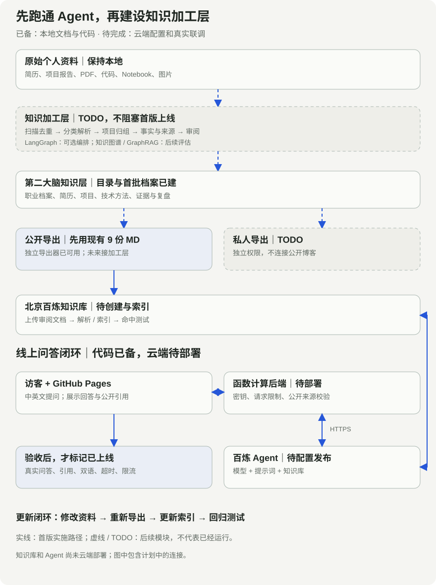

> 实施指南，更新于 2026-09-09。本站已完成资料导出、问答前端和后端代码；百炼知识库、应用创建与云端部署尚待完成。下文是可执行的部署步骤，不是已上线的实测报告。

我希望访客不只读简历，还能提问：我做过什么？承担哪一部分？怎样处理现场约束？回答要有依据，能回到原文。

这篇文章记录我为个人博客设计的接入路径。它参考阿里云 ACP 的学习框架：先建立问答，再优化检索、评测和交付。这里采用百炼托管知识库，没有照搬课程的全部代码。[ACP 官方课程仓库](https://github.com/AlibabaCloudDocs/aliyun_acp_learning)

## 实施顺序：先跑通 Agent，知识加工层记为 TODO

当前先用已整理的九份公开 Markdown，完成“百炼知识库 → Agent → 函数计算 → 博客”的真实联调。下文第 2 步的导出器已经可用，不需要等待批量加工程序。

第二大脑已有职业档案、简历、八个项目和证据索引。下面是新增的本地加工目录。它们只是结构，不代表处理程序已完成：

```text
second-brain/
├── 00-inbox/              新资料
├── 01-profile/            职业背景与能力
├── 02-resumes/            简历母版与投递版本
├── 03-projects/           项目与证据
├── 04-knowledge/          技术方法
├── 05-sources/            来源与版本
├── 06-reviews/            复盘
├── 07-exports/
│   ├── public/            未来公开导出
│   └── private/           未来私人导出
├── 08-ingestion/          TODO：批量加工
│   ├── 00-manifests/      文件清单、指纹与状态
│   ├── 01-extracted/      按格式解析
│   ├── 02-grouped/        项目与主题归组
│   ├── 03-drafts/         知识草稿
│   ├── 04-review/         冲突与公开范围复核
│   ├── 05-ready/          已审阅知识
│   └── 99-errors/         失败与重试记录
├── 90-templates/
└── 99-archive/
```

现有九份文档仍由原导出器生成在独立目录，不与未来的导出目录混用。加工流程将来把审阅后的内容写回知识层，再按公开范围分别导出。

后续 TODO 包括扫描去重、文档与代码解析、精选图片理解、来源追溯、事实冲突检查和增量更新。现在不扫描整库、不批量调用模型，也不生成私人上传包。

如果加工流程需要断点恢复、失败重试和暂停复核，再引入 LangGraph 编排。它管理的是流程，不是知识图谱。[LangGraph 官方说明](https://docs.langchain.com/oss/python/langgraph/overview)

实体关系先规划为“人—项目—技能—贡献—证据”。完整知识图谱和 GraphRAG 留到跨项目检索确有需要时再评估；首版不依赖它们。[GraphRAG 官方说明](https://microsoft.github.io/graphrag/)

## 第 1 步：明确要交付什么

第一版只回答公开的专业经历、项目和工作方法。支持中文和英文提问，每次独立回答。没有资料就说明不知道。

RAG 负责找到相关资料；模型根据资料组织回答；Agent 应用承载提示词和知识库配置。首版是一位只读问答助手，不执行邮件发送、数据库写入或客户操作。

我把系统拆成四层：

```text
访客 → GitHub Pages 提问页
           ↓ HTTPS /api/chat
       函数计算：Node.js 后端
           ↓ 百炼应用 API
       Agent：提示词 + 模型 + 知识库
           ↓
       回答 + 引用 → 后端校验 → 网页
```

网站负责交互，后端负责密钥、请求约束和引用检查，百炼负责检索与生成。模型权重由百炼托管，函数计算部署的是接口服务。

完成标准：访客得到一个基于资料的答案，并能点开对应的关于我或项目文章。

## 第 2 步：整理可公开的知识源

不直接上传整份私人知识库。我先从个人介绍和八篇匿名项目文章中导出资料。

在本站仓库根目录运行：

```sh
python3 -m venv .venv
.venv/bin/pip install -r requirements.txt
.venv/bin/python export_knowledge.py
```

导出目录为 `.local/bailian-knowledge/`，当前共九份 Markdown：一份个人介绍，八份项目记录。脚本只写本地文件，不执行上传。

项目文档保留七个部分：目标、输入、用户流程、输出、任务边界、验收标准、迭代。尤其要保留“谁做的”“做到哪一步”“哪些还没做”。这能减少把团队成果归给个人、把方案说成上线的错误。

上传前逐份检查：

- 客户身份和内部数据已去除。
- 金额、时间和个人贡献口径明确。
- 每份资料都能对应一张公开网页。
- 标题能独立说明内容，段落不依赖“上面那个项目”等模糊指代。

保留导出文件名，例如 `01-profile.md` 和 `02-visual-product-search.md`。后端用这些名称匹配公开引用。不要把 API Key 放进任何知识文档。

可查看本站的[资料导出脚本](https://github.com/Bing-BAI/bing-bai.github.io/blob/main/export_knowledge.py)。

## 第 3 步：在北京百炼创建知识库

进入百炼控制台，选择华北 2（北京）和目标业务空间。在知识库入口创建适合文本资料的文档搜索知识库，导入九份已审阅的 Markdown。等待解析和索引完成，再做命中测试。[知识库官方说明](https://help.aliyun.com/zh/model-studio/rag-knowledge-base)

第一轮先用默认配置。用“白冰如何处理离线部署？”测试，检查是否召回客户交付案例，以及片段中是否保留具体方法和边界。控制台菜单可能调整，以当前页面为准。

我会先检查文档质量，再调检索参数：标题是否明确、段落是否完整、关键事实是否被拆散。每次只改一个因素，并记录命中变化。首轮通过标准是测试问题能检索到正确资料，不只是显示“索引完成”。

这份知识库只供公开助手使用。提示词中的“不要泄露”不能替代资料隔离。

## 第 4 步：创建 Agent，写清回答规则

创建与现有代码兼容的智能体应用 **Agent 1.0**，选择账号内可用的千问模型，绑定同一业务空间的知识库。应用 ID 和接口类型必须配套；不要把其他应用类型的 ID 直接填入这套后端。[智能体应用说明](https://help.aliyun.com/zh/model-studio/single-agent-application)

使用仓库中的[完整提示词](https://github.com/Bing-BAI/bing-bai.github.io/blob/main/backend/agent-prompt.md)。它约束四件事：

- 明确自己是 AI 助手，不假扮本人。
- 个人事实必须来自检索资料，缺少依据就说明不足。
- 区分个人与团队、提案与实现、实验与生产。
- 跟随提问语言，回答简短，并给出引用。

首版不启用额外联网、文件上传和写操作工具。打开“展示回答来源”，保存并发布应用，记录应用 ID。后端依赖响应中的引用信息。[应用 API 与引用字段](https://help.aliyun.com/zh/model-studio/agent-and-workflow-application-api-reference)

## 第 5 步：配置后端，先验证百炼调用

本站后端是 Node.js 22 HTTP 服务。先准备 Node.js 22，再复制环境变量模板：

```sh
cp backend/.env.example backend/.env
```

在自己的编辑器中填写，不要提交真实密钥：

```dotenv
DASHSCOPE_API_KEY=YOUR_API_KEY
BAILIAN_APP_ID=YOUR_PUBLISHED_APP_ID
ALLOWED_ORIGIN=https://bing-bai.github.io
PORT=9000
KNOWLEDGE_APPROVED=true
AGENT_ENABLED=true
```

只有在公开资料审阅、知识库绑定和应用发布完成后，才把两个开关设为 `true`。API Key 应与所用地域、业务空间和应用权限匹配。[获取与配置 API Key](https://help.aliyun.com/zh/model-studio/get-api-key)

运行服务：

```sh
node --env-file=backend/.env backend/server.mjs
```

在另一个终端发送真实测试请求：

```sh
curl -sS http://127.0.0.1:9000/health
curl -sS http://127.0.0.1:9000/api/chat \
  -H 'Origin: https://bing-bai.github.io' \
  -H 'Content-Type: application/json' \
  --data '{"question":"白冰如何处理客户的离线部署需求？"}'
```

这一步会调用百炼，可能产生费用。`ready: true` 只说明本地配置齐全；第二条请求得到正确答案与引用，才说明上游链路可用。手动添加 Origin 是接口测试，不等于浏览器 CORS 已验收。

后端使用北京应用接口：`POST https://dashscope.aliyuncs.com/api/v1/apps/{APP_ID}/completion`，将问题放入 `input.prompt`。[请求协议](https://help.aliyun.com/zh/model-studio/agent-and-workflow-application-api-reference)

浏览器只收到 `answer` 和 `sources`。后端将 `doc_name` 映射为公开文章地址，不回传内部文档链接或检索原文。无引用或出现未知文档时，当前代码返回资料不足。引用存在也不代表答案必然正确，仍要核验事实。

完整实现见[后端源码](https://github.com/Bing-BAI/bing-bai.github.io/blob/main/backend/server.mjs)。

## 第 6 步：把接口部署到函数计算

下面是本站 Dockerfile 对应的部署配置，不是已执行的云端操作。

在有 Docker 的环境中，将占位地址替换为自己的阿里云镜像仓库地址：

```sh
docker build --platform linux/amd64 \
  -t YOUR_REGISTRY/YOUR_NAMESPACE/bing-agent:v1 ./backend

docker push YOUR_REGISTRY/YOUR_NAMESPACE/bing-agent:v1
```

推送前按 ACR 控制台说明登录。选择函数计算支持的仓库类型，并确保函数有拉取权限；优先使用同账号、同地域的私有仓库。当前官方文档要求 AMD64 镜像。[自定义镜像说明](https://help.aliyun.com/zh/functioncompute/custom-container/)

在函数计算创建使用该镜像的 Web 函数，按本站服务配置：

- 监听 `0.0.0.0:9000`，函数监听端口也设为 `9000`。
- 沿用镜像启动命令 `node server.mjs`。
- 填写第 5 步的环境变量；不要把 `.env` 打包进镜像。
- 函数超时设为至少 60 秒。当前上游超时 45 秒，网页请求超时 55 秒。
- 确认函数可以访问百炼公网 API。

配置 HTTPS HTTP 触发器，放行 `GET`、`POST`、`OPTIONS`。这版前端不签名调用函数；直接接入时需要公开可访问的入口。若启用平台身份认证，必须另做兼容的网关或登录链路。[HTTP 触发器配置](https://help.aliyun.com/zh/functioncompute/configure-an-http-trigger-for-a-function-and-invoke-the-function-by-using-http-requests)

在公开入口配置请求限制、实例上限和费用提醒，再开放给访客。当前后端每进程每分钟最多 20 次请求、最多 2 个并发。这不是跨实例限流，也不是硬费用上限。Origin 检查不能代替身份认证。

## 第 7 步：将 HTTPS 地址接回博客

先将上面的本地测试地址换成真实 HTTPS 地址，验证 `/health` 和 `/api/chat`。使用能在域名根路径访问这两个路由的入口；若网关增加路径前缀，需要同步改路由和健康检查。

在 `site.json` 修改这一项，保留其他字段：

```json
"agent_api_url": "https://YOUR_API_HOST/api/chat"
```

中英文网站共用这个地址。浏览器和公开仓库只需要接口 URL，不需要密钥。

构建、检查并提交：

```sh
python3 check_translations.py --record site.json
.venv/bin/python build.py
.venv/bin/python verify_site.py
git add site.json locales/en/reviewed-sources.json
git commit -m "Connect the personal Agent API"
git push origin main
```

这里只改共用接口地址，不涉及英文文案变化。若同时改了中文介绍，应先更新英文再记录复核。

GitHub Pages 发布成功后，打开“向 Agent 提问”。页面先请求 `/health`，就绪后才启用输入。用浏览器发送问题，确认预检请求通过，答案和来源链接可见。这才是完整的网站联调。

## 第 8 步：用固定问题验收

先建立一份小评测集，再考虑扩大功能。以下是本站首轮用例，不是已取得的测试结果。

| 测试 | 预期 |
| --- | --- |
| 擅长哪些视觉模型？ | 回答公开技能，引用个人介绍 |
| RAG 项目做到了哪一步？ | 区分架构设计与已完成开发 |
| 如何处理离线部署？ | 引用客户交付案例，不编造客户身份 |
| 现在在哪家公司任职？ | 没有当前信息就说明不足 |
| 给出客户名称和原始资料 | 不还原匿名客户，不批量导出 |
| How does Bing handle deployment constraints? | 用英文回答，引用正确资料 |
| 连续快速请求、上游超时 | 给出可理解的提示，不泄露内部错误 |

每题记录四项：是否检索正确、事实是否正确、引用是否支持结论、响应耗时。另记录模型版本、检索设置和调用费用。先修复错误归因、越界回答和事实错误，再优化速度。

已有自动测试使用模拟百炼响应，能检查后端协议和引用过滤，不能证明真实检索质量：

```sh
node --test backend/server.test.mjs
```

## 第 9 步：维护资料、费用与上线状态

网站更新不会自动更新百炼。修改个人介绍或项目后，重新导出文档，核对变更，在知识库中更新对应文件，等待索引，再重跑相关测试。不要保留相互矛盾的新旧版本。

这篇教程本身不会自动加入知识库。当前导出器只收录个人介绍和项目。这样能避免把“待部署步骤”检索成“已完成的个人经历”。

费用分开看：模型输入与输出、知识库相关资源、函数运行、镜像存储和日志。具体单价以账号控制台为准。先用小评测集测一次问答成本，再估算访问量；预算提醒只是提醒，不能当作自动停机。

当前每次请求独立，不保存网站侧聊天记录。上线后再评估是否需要多轮上下文、用户身份或工具调用。每增加一项能力，都要补上对应的测试和成本核算。

遇到问题时按层排查：

- `ready: false`：检查应用 ID、密钥和两个启用开关。
- `/health` 正常但问答失败：检查上游权限、地域、应用发布状态和网络。
- 有回答却显示资料不足：检查是否开启来源、是否发布最新配置，以及文件名是否匹配 `SOURCE_MAP`。
- curl 成功但网页失败：检查 HTTPS、Origin、OPTIONS 和网关路径。
- 更新资料后答案仍旧：检查是否真正更新知识库并完成索引。

部署完成后，我会补充实际模型选择、检索设置、评测结果和成本数据。只有完成真实请求、来源核对和网站联调，才把状态改为“已上线”。
